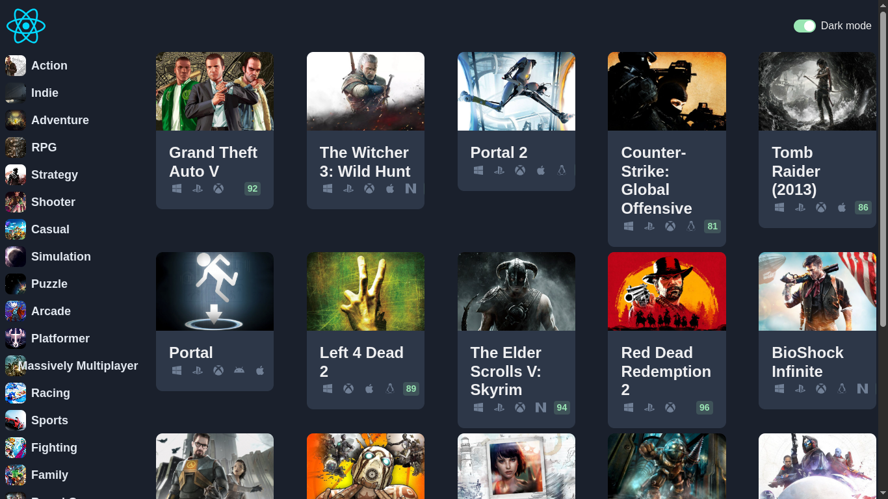

# Static One-Page React Website

A simple one-page website built with **React** as a practice project. This site is static and does not include interactivity yet, but it's a starting point for learning React structure, styling, and component organization.

## 🖼️ Screenshot



## 🚀 Features

- React-based single-page layout
- Basic component structure
- Clean and minimal styling
- Chakra ui

## 🛠️ Getting Started

```bash
# Clone the repo
git clone https://github.com/cvnxsolution/game-hub
cd game-hub

# Install dependencies
npm install

# Start the development server
npm start
```
